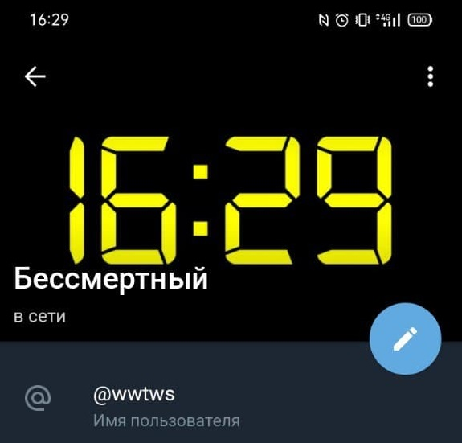

# TelegramClock
This app will make a clock out of your telegram avatar. The time will be updated every minute.

 

## How to use
___
1. Clone this repo
2. Go to [this](https://core.telegram.org/api/obtaining_api_id) page and get your **appID** and **apiHash**
3. Paste your data into the **"settings/user.json"** file
4. Build this app `go build main.go`
5. Run .exe file
6. Paste confirmation code to console. This can only be done once. After that, your session will be saved to the session file. 

## Settings
___
You can customize background color and clock color.

You can also adjust the time offset if your server is in a different time zone. 

these settings are in the file **"/settings/clock.json"**